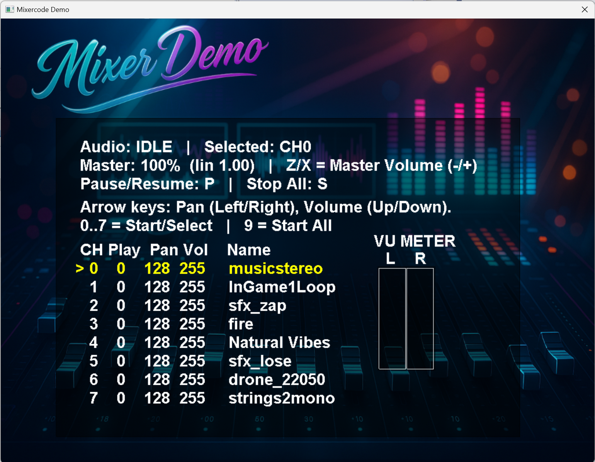

# C++ XAudio2 Mixer and Streaming System



This project provides a modern C++ audio mixer and sample playback system built on **XAudio2**. It supports **WAV**, **OGG**, and **MP3** playback, mono/stereo sources, on-the-fly resampling, optional 2D positional audio, music-track crossfading, parameter sweeps (volume / pan / frequency), and safe memory management via smart pointers. It is written with high-performance game and emulator audio needs in mind.

## What's New

The mixer offers **two playback paths** and you pick per-sound at playback time:

- **Voice path** (`sample_start`) - one `IXAudio2SourceVoice` per channel. XAudio2 handles mixing and pitch natively. Best for one-shot SFX and looped samples; supports real-time volume / pan / frequency changes with extreme pitch range (up to 8x).
- **Software mixer path** (`sample_start_mixer`, `stream_start`) - all active channels are mixed into a single interleaved S16 stereo buffer each frame and submitted to XAudio2. Best for emulator-generated audio, live streams, or samples that pop/crack when looped. Supports 8/16-bit mono/stereo sources, inline resampling on streams (`stream_set_native_rate`), and a VU meter (optional).

Both paths share the same channel and sample registry - load once, play anywhere. The mixer thread runs on its own worker, signaled once per frame from your main loop. Sample loading is **buffer-based** (no direct file dependency in the mixer), with a helper in `core/sys_fileio.h` (`loadSampleFromFileOrZip`) for loose files or zips. Loaded samples can be resampled to the system rate on load (default), and `mixer_alloc_channel` provides MAME-style dynamic channel allocation for chip-stream voices.

A `Music` namespace (`mixer/music.h`) sits on top of the mixer for background music with hard play, crossfade, pause/resume, music-master volume, and decode-to-memory looping.

For Windows 7 support, build with `WIN7BUILD` defined to use the `xaudio2redist` NuGet package; otherwise the system `<xaudio2.h>` + `xaudio2.lib` are used.

## ✅ Features

- **Two playback paths**: per-voice XAudio2 or software mixer
- **8/16-bit WAV**, **OGG**, and **MP3** loading (OGG/MP3 gated by `OGG_DECODE` / `MP3_DECODE`)
- **Mono and stereo** sources; load-time resampling (cubic 16-bit, linear 8-bit)
- **Streaming** with inline rate conversion (`stream_set_native_rate`)
- **Parameter sweeps**: timed linear interpolation of volume, pan, and frequency
- **2D positional audio** via `audio_3d` (`mixer_set_listener_2d`, `sample_set_world_position`)
- **Music subsystem** with crossfade and decode-to-memory looping
- **Master volume** with perceptual dB-tapered curve (0..255 byte and 0..100 percent APIs)
- **Output channel introspection** (`mixer_get_output_channels`, channel mask) for 5.1 / 7.1 / Atmos sanity checks
- **Optional VU meter** (define `USE_VUMETER`)
- **Thread-safe** sample/channel APIs (single audio mutex)
- Smart-pointer-managed sample memory (`std::unique_ptr` / `std::shared_ptr`)

---

## 🔧 Requirements

- Windows 7+ (XAudio2 2.9 via system SDK on Win8+, or via `xaudio2redist` NuGet for Win7)
- C++17 or later
- Bundled: `stb_vorbis` (OGG) and `minimp3` (MP3) for optional decoders, `miniz` for zip-backed loading

---

## 🔌 Usage Overview

### Mixer Initialization

```cpp
mixer_init(44100, 60); // 44.1 kHz output, 60 fps signaling cadence
```

`fps` is an **integer** - the audio thread submits one buffer of `rate/fps` frames each time `mixer_update()` is called. Match it to your render tick (typical values: 30 or 60).

### Loading a Sample

The mixer takes a buffer; the caller handles file I/O. The bundled `core/sys_fileio.h` helper does both loose files and zip archives:

```cpp
#include "sys_fileio.h"

int snd = loadSampleFromFileOrZip(nullptr,    "sfx/explosion.wav");
int mus = loadSampleFromFileOrZip("game.zip", "music/level1.ogg");
```

Or feed `mixer/mixer.h` directly:

```cpp
std::vector<uint8_t> wav = read_file("shoot.wav");
int snd = load_sample_from_buffer(wav.data(), wav.size(), "shoot");
```

### Playing a Sample

```cpp
// Voice path: direct XAudio2 source voice
sample_start(0, snd, 0);              // channel 0, no loop
sample_set_volume(0, 200);            // 0..255
sample_set_pan(0, 64);                // 0 = full L, 128 = center, 255 = full R
sample_set_freq(0, 22050);            // pitch shift via frequency ratio

// Software-mixer path: mixed into the per-frame submission buffer
sample_start_mixer(1, snd, 1);        // channel 1, looping
```

### Streaming (emulator-style live PCM)

```cpp
stream_start(2, 0, 16, 60, true);     // ch 2, 16-bit, 60 fps, stereo
// stream_set_native_rate(2, 96000);   // optional: source runs at 96 kHz, mixer resamples inline

// each frame:
short pcm[44100 / 60 * 2];            // 735 stereo frames
generate_audio(pcm);
stream_update(2, pcm);
mixer_update();                       // signal the audio thread
```

### Mixer Tick

Call once per frame after any per-frame `stream_update` calls:

```cpp
mixer_update();
```

---

## 🔊 Volume, Pan, Frequency

```cpp
sample_set_volume(0, 128);            // 0..255 (perceptual dB curve)
sample_set_volume_percent(0, 50);     // 0..100 (perceptual dB curve)
sample_set_pan(0, 128);               // constant-power pan
sample_set_freq(0, 22050);            // voice path: pitch shift; mixer streams: see stream_set_native_rate
sample_stop(0);                       // immediate
sample_end(0);                        // graceful (exit loop, play tail)
```

### Global / Master

```cpp
mixer_set_master_volume(80);          // 0..100
pause_audio();                        // mutes master, freezes software mixer
restore_audio();                      // restores previous master volume
samples_stop_all();                   // panic: stop everything
```

### Parameter Sweeps

```cpp
mixer_ramp_volume(0, 500, 0);         // fade ch 0 to silent over 500 ms
mixer_sweep_pan(0, 1000, 255);        // pan right over 1 second
mixer_sweep_frequency(0, 2000, 8000); // voice path only; pitch glide
```

---

## 🎵 Music

```cpp
#include "music.h"

Music::init();                        // after mixer_init
int title = Music::load_from_file("audio/title.ogg");
Music::set_volume(70);
Music::play(title);                   // loops by default

int level1 = Music::load_from_file("audio/level1.ogg");
Music::fade_to(level1, 2000);         // 2-second crossfade

Music::stop(500);                     // fade out
Music::shutdown();                    // before mixer_end
```

Decoded PCM stays in RAM, so crossfades and looping are gapless and pay no per-frame decode cost.

---

## 🎧 2D Positional Audio

```cpp
mixer_set_listener_2d(player_x, player_y);
sample_start(3, snd, 1);
sample_set_world_position(3, npc_x, npc_y);  // pan/attenuation tracks listener motion
// ... later:
sample_clear_world_position(3);
```

---

## 📊 VU Meter (Optional)

Define `USE_VUMETER` for the translation unit:

```cpp
float l = 0.f, r = 0.f;
mixer_get_vu(&l, &r);                 // 0..1, decays automatically
```

Only the **software mixer path** feeds the meter - voice-path channels are mixed by XAudio2 internally and don't contribute to `peakL/peakR`.

---

## 🔁 Voice Path vs Mixer Path

| Feature                 | Voice path (`sample_start`) | Mixer path (`sample_start_mixer` / `stream_*`) |
|-------------------------|------------------------------|-------------------------------------------------|
| Backend                 | `IXAudio2SourceVoice`        | Software mix → submission buffer                |
| Pitch / frequency       | Yes, up to 8x via ratio      | Streams only (`stream_set_native_rate`)         |
| Pan / volume            | Yes                          | Yes                                             |
| Per-sample seek         | No                           | Yes (`sample_set_position`)                     |
| Feeds VU meter          | No                           | Yes                                             |
| Best for                | One-shot SFX, music          | Emulator/chip streams, looping that must be seamless |

---

## 📦 Sample Structure

```cpp
struct SAMPLE {
    WAVEFORMATEX fx = {};
    uint32_t sampleCount = 0;
    uint32_t dataSize = 0;
    SoundState state = SoundState::Null;
    int num = -1;
    std::string name;
    std::unique_ptr<uint8_t[]> data8;    // 8-bit PCM
    std::unique_ptr<int16_t[]> data16;   // 16-bit PCM
    void* buffer = nullptr;              // active buffer (data8 or data16)
};
```

---

## 💾 Saving Audio

```cpp
std::vector<uint8_t> wav;
if (save_sample_to_buffer(sample_id, wav)) {
    // write wav.data() / wav.size() to disk yourself
}
```

---

## 🧠 Sample Lookup Helpers

```cpp
std::string name = numToName(sample_id);
int id           = nameToNum("jump");
int index        = snumlookup(sample_id);  // index into internal vector
```

---

## 📚 File Layout

```
mixer/
  mixer.h / mixer.cpp           Core mixer, sample registry, software mix loop
  xaudio2_backend.h / .cpp      XAudio2 submission backend (IAudioBackend impl)
  audio_3d.h / .cpp             2D positional audio (X3DAudio wrapper)
  music.h / music.cpp           Music namespace (decode-to-memory + crossfade)
  stb_vorbis.[ch]               OGG decoder
  minimp3*.h                    MP3 decoder
  error_wav.h, emptywav.h       Built-in fallback PCM blobs
core/
  sys_fileio.[h/cpp]            loadSampleFromFileOrZip, file/zip I/O
  sys_log.[h/cpp]               LOG_* macros
  miniz.[ch]                    Zip read support
  ... + platform glue (winfont, rawinput, ini, etc.)
```

---

## 🧵 Threading Model

```
Main thread          -> mixer_update()  -> signals audio thread
Audio worker thread  -> mixer_update_internal() (locks audioMutex, mixes, submits)
Sweep worker thread  -> ~1 ms tick, drives mixer_ramp_volume / sweep_pan / sweep_frequency
```

The main thread must not call `mixer_update_internal()` directly. All sample/channel manipulation acquires `audioMutex` internally and is safe from any thread.

---

## 🔐 License

GPL-3.0-or-later.

If you like and improve it, please consider sharing your changes!

---

## 📞 Contact

Created by **Tim Cottrill** (2022-2026)
